# Skreper - Ecommerce Web Scraper

Photo by [Mark König](https://unsplash.com/@markkoenig) on [Unsplash](https://unsplash.com/photos/Tl8mDaue_II)

## Introduction

Skreper is a web-based scraping application that focuses on Indonesia ecommerce sites. The main goal of Skreper is to enable everyone to do data extraction for research and study purposes. Currently, there are 2 ecommerce sites available for data extraction on Skreper, Tokopedia and Nike Indonesia; more sites are going to be added in the future.

Assisting in data extraction when no public API is available; Skreper scrapes and compiles the scraped data into CSV format for subsequent analysis or machine learning model development.

## Features

- Data extraction
- Extracted data can be retrieved via downloading or sending it to the registered users' email address

## Packages/ libraries used in this project

- BS4
- Selenium
- Pandas
- Jinja
- Flask
- Flask-SQLAlchemy
- Flask-WTF
- WTForms
- Flask-Login
- Flask-Bcrypt
- Flask-Mail
- PyYAML

## Important notes

- Ecommerce websites are prone to changes, please notify me if Skreper is not working, you can reach me out on [discord](https://discordapp.com/users/525654231940857867)
- Replace the data/ credential of the yaml file with your own data.
- Template for Skreper can be found on [Bootstrapious](https://bootstrapious.com/)
- Skreper is not running asynchronously/ concurrently, if somebody is willing to help me improve this application, please kindly reach me out on [discord](https://discordapp.com/users/525654231940857867), I am looking for someone who has the knowledge/ experience of Flask, Celery, Rabbit MQ, Redis, RQ, and Heroku. 

## Skreper - websites

>  Landing page

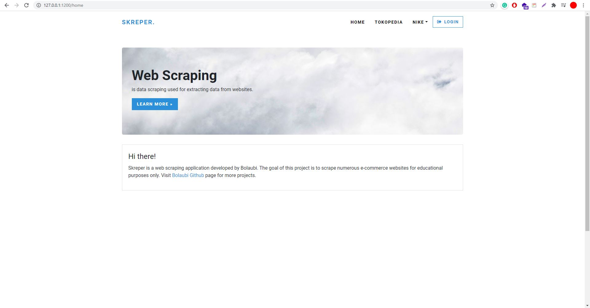

  

> Login page

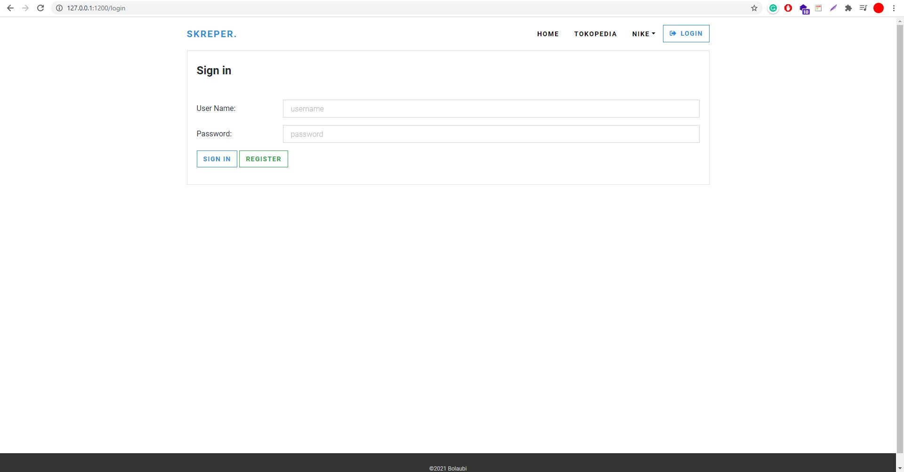

  

>  Register page

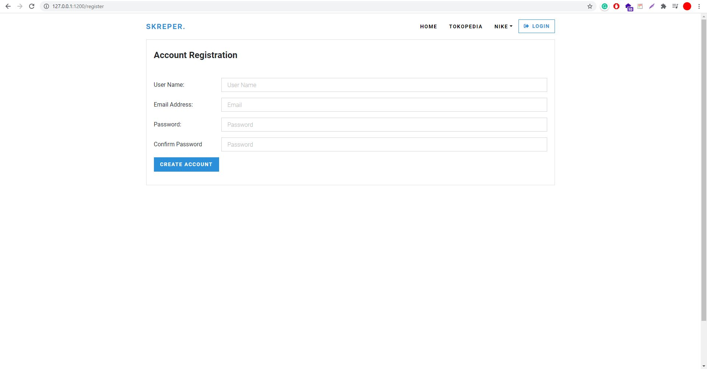

  

> Logged in page

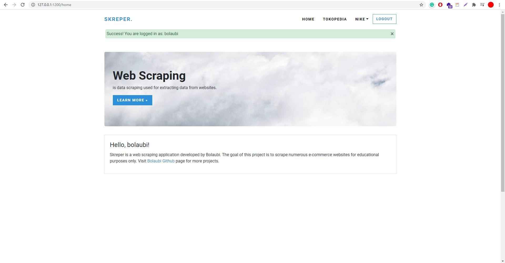

  

> Scraping Tokopedia page

  

> Scraped Tokopedia page

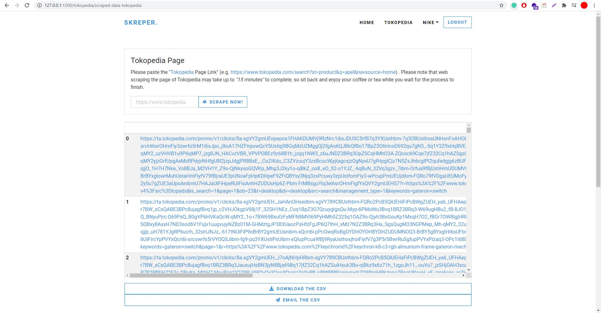

  

> Scraping Nike Indonesia page

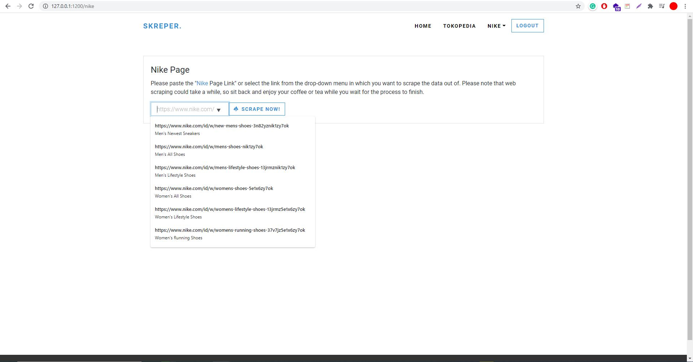

  

> Scraping Nike Sales Indonesia page

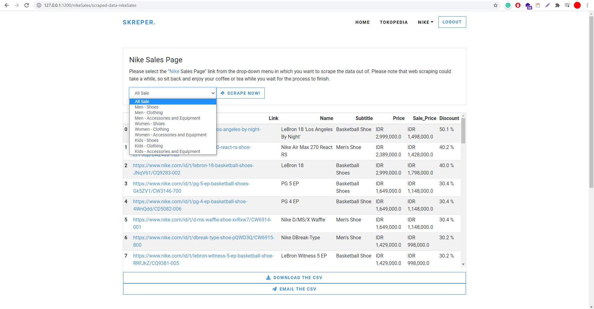

  

> Scraped Nike Sales Indonesia page

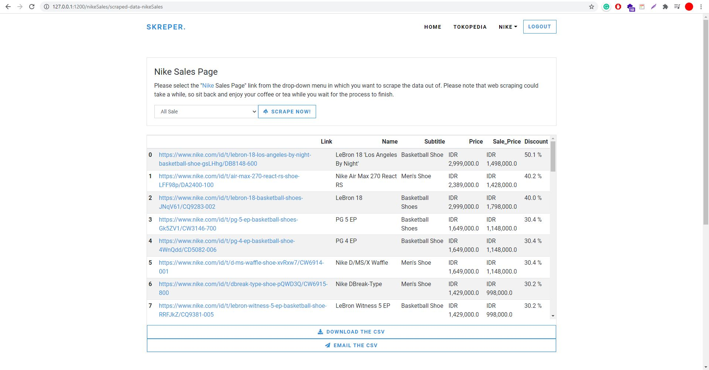

  

> Downloaded Nike Sales Indonesia page

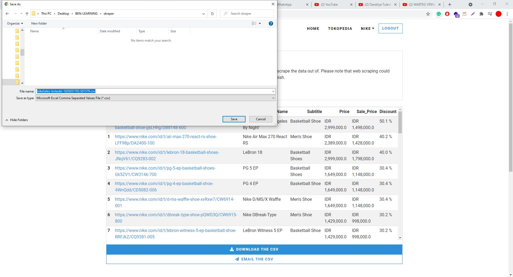

  

> Sent email Tokopedia page

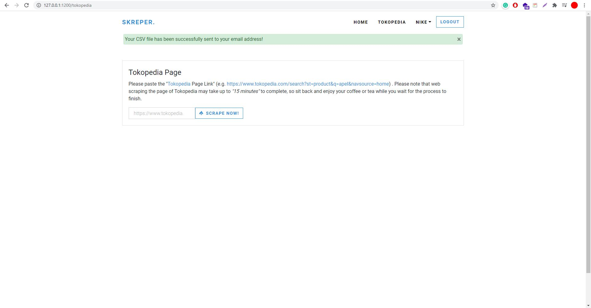

  

> Logged out page

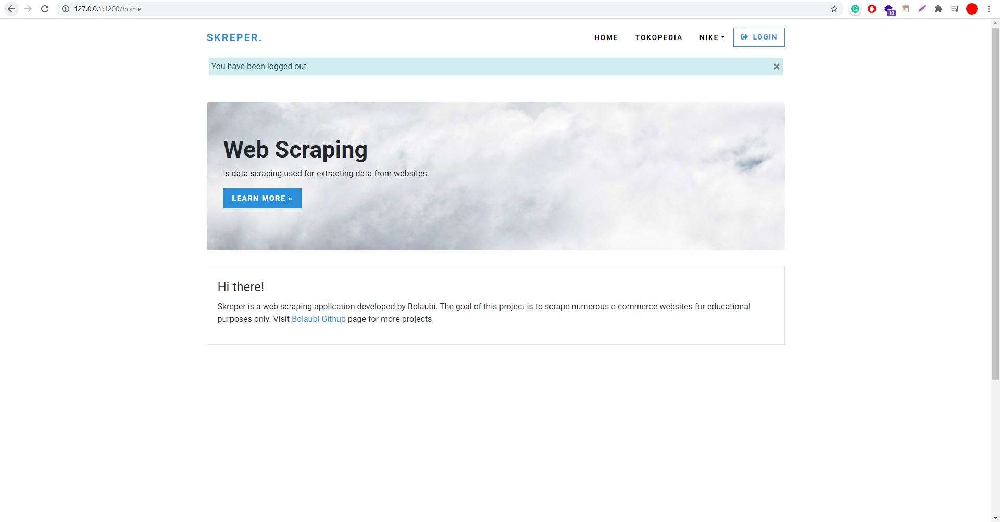

  

## Profile

© Benedict Laiman 2021

Get in touch with me through:

- [Linkedin](https://www.linkedin.com/in/benedict-laiman-60401319a/)
- [Discord](https://discordapp.com/users/525654231940857867/)

